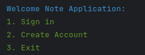
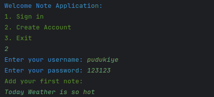
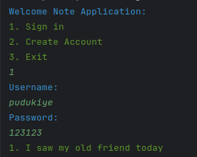
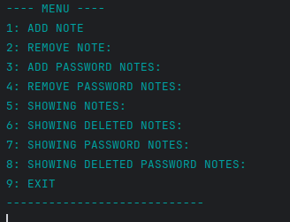
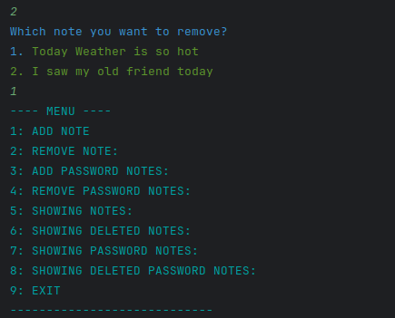
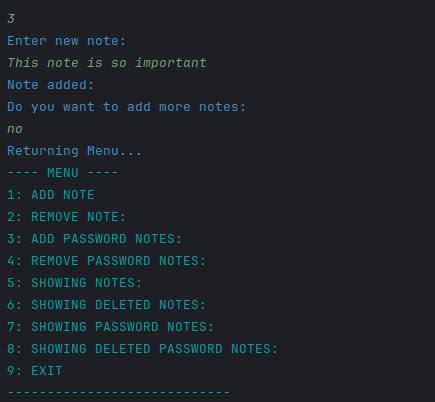
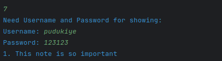

## 🗒️ Note-App-Cli
A terminal-based note management system built using only arrays and pointers, without any structs or advanced containers.

## ✨ Features
📌 Add notes

🗑️ Delete notes

🧹 View deleted notes

🔒 Create password-protected notes

🧿 View and manage secured notes

⚡ Dynamic memory management with arrays and pointers

## ⚙️ Technical Details
- Pure C++
- Only arrays and pointers used
- No struct, class, vector, or any high-level data structures
- Modularized with separate .cpp and .hpp files
- Manual memory handling (new, delete)
- Pointer usage maximized intentionally to deepen understanding of logic and memory management
- All operations handled on the heap without any memory leaks

## 📝 Notes
This project was intentionally developed in a maximally challenging way:

🧠 Pointer usage is maximized to train deeper logical thinking.

🚫 No shortcuts like structs or vectors were used.

🛠️ Demonstrates how to build dynamic and secure systems at a low level.

## Project Structure
```
/utils
    create_account.cpp / create_account.hpp
    first_page.cpp / first_page.hpp
    menu.cpp / menu.hpp
    sign_in.cpp / sign_in.hpp
    terminal.hpp
    user.cpp / user.hpp
main.cpp
CMakeLists.txt
.gitignore
.gitattributes
```
## Build & Run
```
mkdir build
cd build
cmake ..
make
./Note_App
```
## First Page



## Create Account



## Sign in 



## Main Menu



## Add Note


## Delete Note



## Add Password Note



## Show Password Notes



